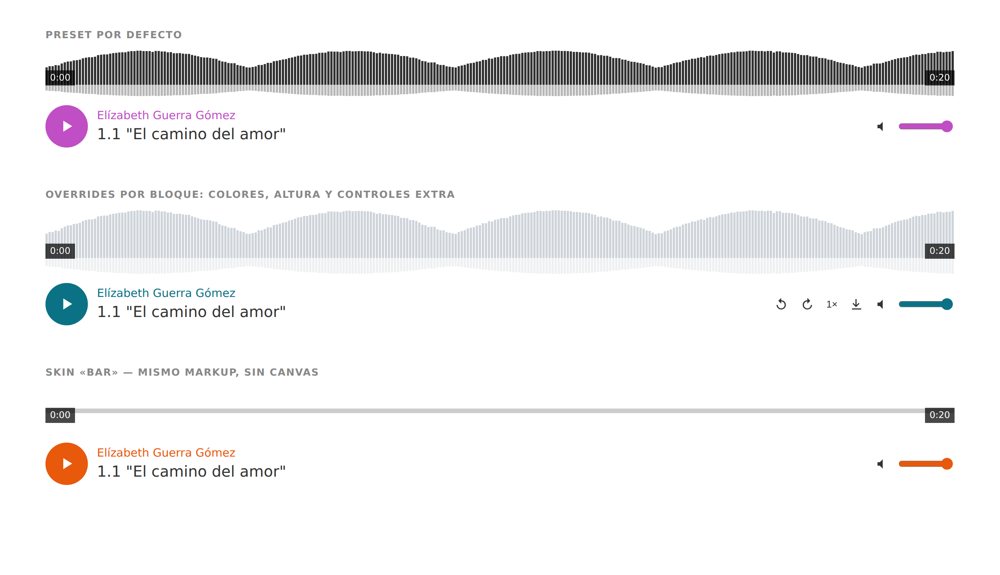

# Imagina Player

Reproductor de audio con forma de onda para WordPress: bloque de Gutenberg,
presets reutilizables y un núcleo de ~5 KB gzip sin dependencias.



## Estado

`0.1.0` — audio completo y funcional. El vídeo está preparado en el núcleo pero
su interfaz específica todavía no está construida (ver
[docs/ARQUITECTURA.md](docs/ARQUITECTURA.md#vídeo-siguiente-fase)).

## Instalación para desarrollo

```sh
npm install
npm run build      # o `npm start` para recompilar al guardar
./tests/run.sh     # suite CLI, no necesita WordPress
```

La carpeta `build/` está versionada a propósito: al clonar el repositorio dentro
de `wp-content/plugins/` el plugin funciona sin compilar nada.

## Uso

**Bloque:** _Imagina Audio Player_, en la categoría Multimedia.

**Shortcode:**

```
[imagina_player src="https://cdn.example.com/pista.mp3"
                artist="Elízabeth Guerra Gómez"
                title="1.1 El camino del amor"
                preset="default"]
```

Los presets se editan en **Ajustes → Imagina Player**.

**Archivos protegidos:** marca un audio como protegido en su ficha de la
biblioteca de medios y pasará a servirse por un enlace firmado que caduca. Los
detalles, en [docs/PROTECCION.md](docs/PROTECCION.md).

## Documentación

- [Análisis previo](docs/ANALISIS.md) — el plugin que se sustituye, los
  competidores y por qué se reescribe en lugar de bifurcar.
- [Arquitectura](docs/ARQUITECTURA.md) — cómo está montado y por qué.
- [Medios protegidos](docs/PROTECCION.md) — enlaces firmados, configuración de
  nginx, caché de página y el enganche con plugins de cursos.

## Licencia

GPL-2.0-or-later.
